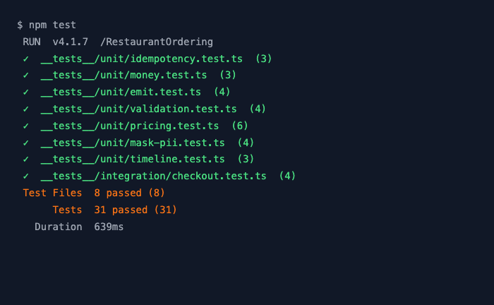
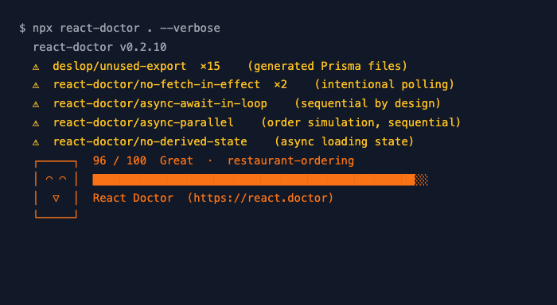
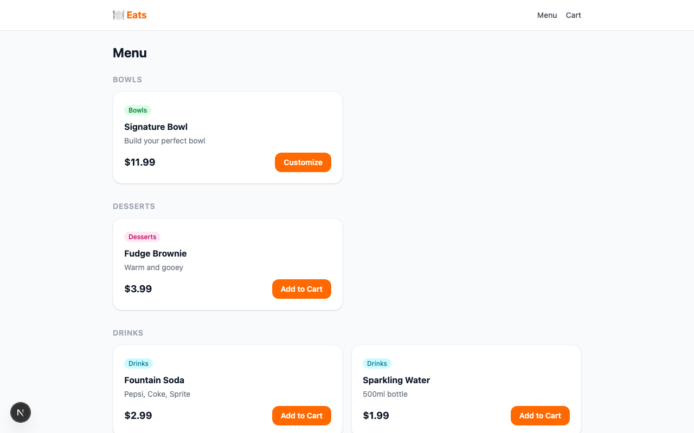
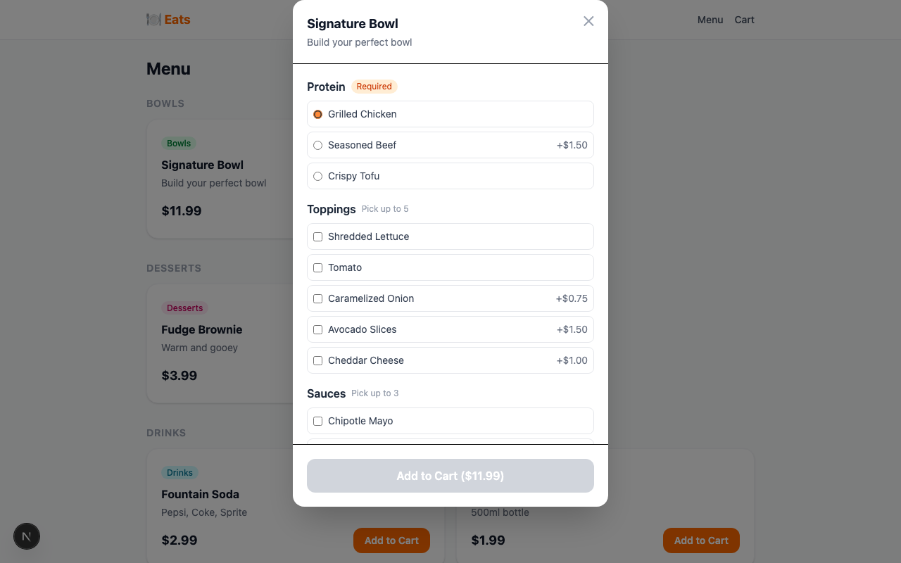
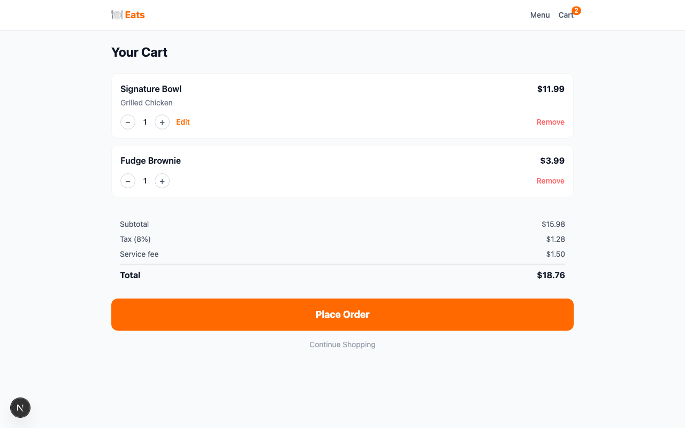
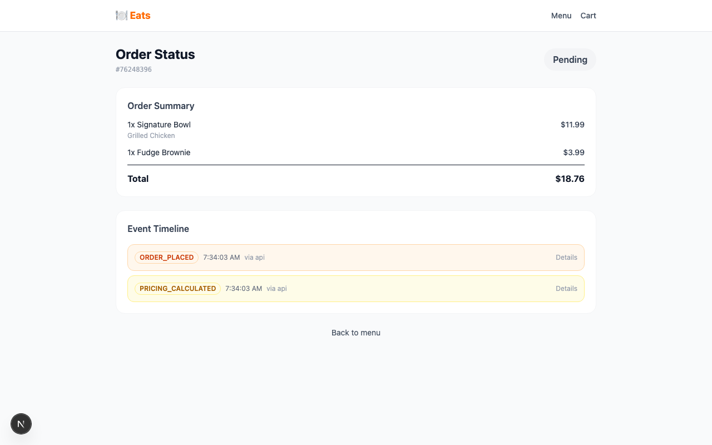

# Restaurant Ordering

A full-stack food ordering app with real-time order tracking and an event timeline.  
Built with Next.js 16, SQLite (no Docker), Zustand, and Prisma.

---

## Database choice

The challenge brief suggests MongoDB or DynamoDB. This project ships with **SQLite (via Prisma 7 + `@prisma/adapter-better-sqlite3`)** instead, for one reason: **a reviewer should be able to clone the repo and run the full system in under 10 minutes with no Docker and no cloud account** — that's the acceptance criterion called out in the brief.

The data layer is fully repository-isolated ([`src/server/repositories/`](src/server/repositories/)) — every DB call is hidden behind `MenuRepo`, `OrderRepo`, `TimelineRepo`, `IdempotencyRepo`. Swapping to MongoDB or DynamoDB is a per-file change behind those four interfaces; nothing in the API routes, services, or UI knows about the underlying store.

---

## Prerequisites

| Requirement | Version |
|---|---|
| Node.js | 20 or higher |
| npm | comes with Node.js |

No Docker. No external database. SQLite runs as a local file.

---

## First Installation

Run these steps **once** when you clone the repo for the first time.

**1. Install dependencies**

```bash
npm install
```

**2. Copy the environment file**

```bash
cp .env.example .env.local
```

The defaults work as-is. No changes needed.

**3. Create the database and load the menu**

```bash
npm run db:push   # creates dev.db with all tables
npm run seed      # loads 7 menu items
```

**4. Start the app**

```bash
npm run dev
```

Open **http://localhost:3000** — you should see the menu with 7 items.

---

## Every Future Run

Once the database exists, you only need one command:

```bash
npm run dev
```

Open **http://localhost:3000**.

> If you ever delete `dev.db` or pull schema changes, re-run `npm run db:push` and `npm run seed` before starting.

---

## Ports

| Service | URL |
|---|---|
| App (Next.js dev) | http://localhost:3000 |
| App (serverless offline) | http://localhost:4000 |
| Database (file) | `./dev.db` |

---

## Running with serverless offline (optional)

The challenge asks for a `serverless.yml` runnable via `serverless offline`. The app is packaged as a single Lambda function that proxies to the Next.js request handler ([`serverless/handler.js`](serverless/handler.js), [`serverless.yml`](serverless.yml)).

```bash
npm run build         # produce the Next.js production build first
npm run sls:offline   # boots serverless-offline on http://localhost:4000
```

`npm run dev` (Next.js dev server on :3000) remains the primary local workflow — `sls:offline` exists for production-packaging parity.

---

## Useful Commands

| Command | What it does |
|---|---|
| `npm run dev` | Start the app (Next.js dev server, http://localhost:3000) |
| `npm run build` | Produce the Next.js production build |
| `npm run sls:offline` | Run the app behind `serverless-offline` (http://localhost:4000) — requires a prior `npm run build` |
| `npm run seed` | Reload the 7 menu items |
| `npm run db:push` | Sync schema changes to the database |
| `npm run db:studio` | Open a visual database browser |
| `npm test` | Run all tests |
| `npm run type-check` | Check TypeScript |
| `npm run lint` | Run ESLint over `src/` |

---

## Quality

### Test suite — 31 tests across 8 files



Run with `npm test`. Covers pricing math, PII masking, idempotency, payload size limits, timeline deduplication, modifier validation, and the full checkout API flow (integration).

### React Doctor — code health score



Run with `npx react-doctor . --verbose`. The 5 remaining warnings are all intentional: generated Prisma files, the order-status polling hook, and the sequential async order simulation.

---

## Features

### Menu — browse and customize



Products are grouped by category. Items with options (Bowl, Wrap) show a **Customize** button.

---

### Modifier modal — build your order



Select your protein (required), toppings and sauces (optional). The **Add to Cart** button stays disabled until all required choices are made.

---

### Cart — review and checkout



Adjust quantities, edit modifiers, or remove items. Pricing (subtotal, 8% tax, $1.50 service fee) is calculated live. Click **Place Order** to submit.

---

### Order status — real-time tracking



After checkout the page polls every 3 seconds and updates the status badge automatically: Pending → Confirmed → Preparing → Ready → Delivered. The Event Timeline below shows every action taken on the order.

---

### Architecture reference

Visit **http://localhost:3000/appinfo** for an interactive map of the entire codebase — layers, database schema, API contracts, component tree, and the checkout sequence diagram.
